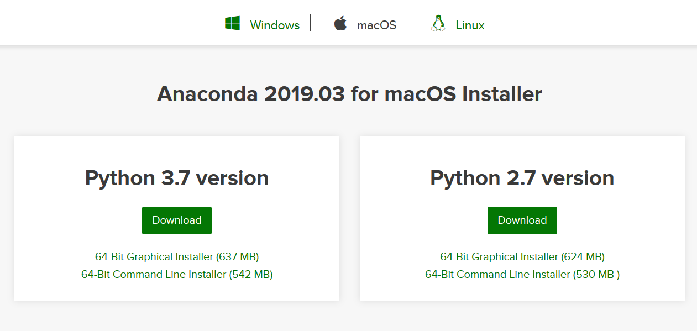
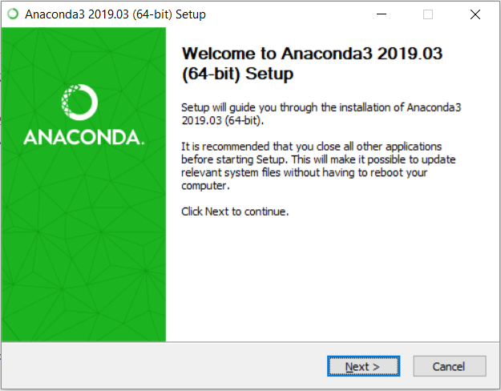
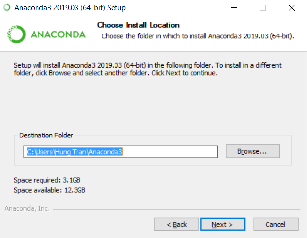
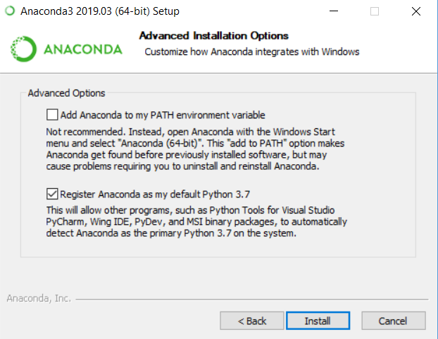
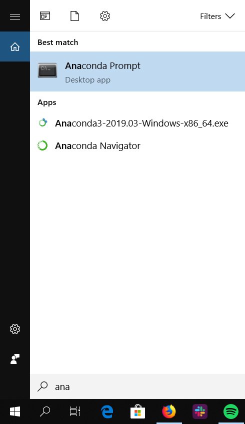

# Hướng dẫn cài đặt Anaconda 
## Download Anaconda
Download tại [link](https://www.anaconda.com/distribution/#download-section)
Các bạn nên nhớ chọn đúng hệ điều hành của mình.

Các bạn đợi một tí, vì file cũng nặng nên download hơi lâu.
### a. For windows:
Chọn version đúng với máy nha, nếu không chắc máy 64 bit hay 32 thì download 32 :) .
Download xong, mấy bạn mở file exe lên:



Chọn next -> I agree -> Next.



Tới bước này các bạn có thể tùy ý chọn đường dẫn thích hợp cho máy của mình.



Ở đây cứ nhấn Install.
Sau đó, Anaconda sẽ hỏi bạn có muốn cài đặt Visual Studio Code không. Riêng mình thì mình reccommend install, nhất là với các bạn mới dùng Python và vẫn chưa có IDE.
### b. For Linux:
```
cd <Thư mục download anaconda về>
chmod 777 Anaconda*.sh 
./Anaconda*.sh (Ở đây nhớ nhấn tab nhẹ một cái rồi mới enter)
```
(Sorry vì mình dẹp Ubuntu vào rồi nên không ghi chi tiết dc :cry: )
## Sử dụng Anaconda
**Đối với Windows:** Bấm vào thanh search, tìm Anaconda Prompt



**Đối với Ubuntu:** Mở terminal lên (Lưu ý là đã cài đặt Environment Variable, Windows nó tự cài).

Mở Anaconda prompt lên. Nhập lệnh sau đây:
```
conda create <ENV NAME>
```
Thay <ENV NAME> bằng tên môi trường (Cái này không quan trọng lắm, nhưng cố nhớ tên môi trường đó).
Khi cài đặt nó hỏi gì cứ bấm **Y** :smile:

Sau đó, ta kích hoạt môi trường.
```
conda activate <ENV NAME>
```
## Cài đặt thư viện
**Lưu ý**: Môi trường vẫn phải đang activate.
Bạn có thể chọn cài đặt một thư viện lớn bất kì trong 2 thư viên dưới, nhưng mình ủng hộ Pytorch nha.
### a. PyTorch:
```
conda install pytorch torchvision cudatoolkit=9.0 -c pytorch
```
Copy lệnh trên vào chạy.
Đối với máy bạn nào có GPU thì xem thử nghiệm bên dưới:
```
python
```
Lúc này, sẽ chuyển qua có thể chạy code Python trên Anaconda Prompt / Terminal.
```
import torch
torch.cuda.is_available()
```
Nếu hiện ra True, thì chúc mừng, thư viện PyTorch đã được cài đặt thành công.
Nếu hiện ra False, nghĩa là máy bạn không có GPU, nhưng vẫn chạy được PyTorch trên CPU nên đừng quá lo lắng.
Nếu không hiện ra gì dù bạn đã làm theo các bước ở trên thì mình cũng không biết :) 
Tutorial hướng dẫn dùng Pytorch: [Bài 1](https://pytorch.org/tutorials/beginner/blitz/tensor_tutorial.html#sphx-glr-beginner-blitz-tensor-tutorial-py)
### b. Tensorflow
Nếu có GPU:
```
conda install tensorflow-gpu
```
Cài đặt phiên bản CPU (Mọi máy đều phải cài)
```
pip install tensorflow
```
Nếu bạn muốn cài đặt thêm Keras (High-end API của Tensorflow)
```
pip install keras
```

Ngoài ra, mình còn dùng nhiều thư viện phụ khác. Nhưng sẽ không đề cập tại đây, bạn nào cần gì trong quá trình làm thì sẽ cài từ từ. Hãy nhớ đến cú pháp bên dưới:
```
pip install <Tên package>
```
Ví dụ: Thư viện đọc và xử lí ảnh PILLOW (Phiên bản nhẹ người hơn của OpenCV :))) ) 
```
pip install pillow
```
